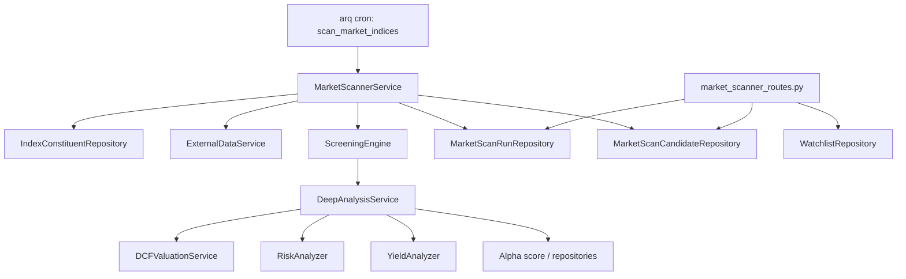

# 指数池价值扫描器技术实现文档

**版本**：V1.0  
**日期**：2026-06-04  
**关联 PRD**：`stockvalue_backend/doc/market_index_value_scanner_prd.md`  
**目标模块**：StockValueFinder Backend  

---

## 1. 技术目标

本功能新增一个后端子系统：**Market Index Value Scanner**。它负责定时扫描沪深 300、中证 500 等指数成分股，运行分层价值筛选，持久化候选结果，并通过 API 提供给前端候选池页面。

技术目标：

- 复用现有外部数据服务、DCF 估值、风险分析、Yield Gap、Alpha Score 和 arq worker 能力。
- 新增独立的 market scanner 模块，避免把指数扫描逻辑塞进现有财报 watcher。
- 让扫描任务可追踪、可重试、可审计。
- 单只股票失败不影响整批扫描。
- 所有筛选阈值和排序权重可配置。
- API 输出保持现有 `ApiResponse` 包装风格。

---

## 2. 现有系统复用点

### 2.1 后台任务系统

现有 worker 位于：

- `stockvaluefinder/pipeline/worker.py`

当前已有：

- `watch_disclosures`
- `process_disclosures`
- `reap_stuck_tasks`
- `WorkerSettings.functions`
- `WorkerSettings.cron_jobs`
- `on_startup`
- `on_shutdown`

指数扫描应新增独立 arq job，例如：

- `scan_market_indices`
- `refresh_index_constituents`

不要复用 `watch_disclosures`，因为它的职责是监控财报披露，不是市场机会扫描。

### 2.2 数据服务

现有统一数据服务位于：

- `stockvaluefinder/external/data_service.py`

可复用能力：

- `ExternalDataService.get_current_price`
- `ExternalDataService.get_financial_report`
- AKShare -> efinance -> Tushare fallback 结构
- Redis cache 机制

需要补充能力：

- 获取指数成分股
- 批量获取基础行情快照
- 获取估值基础字段，如 PE、PB、市值、成交额、是否 ST、停牌状态等

如果现有 AKShare client 已有相近能力，应优先扩展 client；否则在 scanner 内定义窄接口，避免把临时数据格式泄漏到业务层。

### 2.3 分析服务

可复用现有服务：

- `stockvaluefinder/services/valuation_service.py`
- `stockvaluefinder/services/risk_service.py`
- `stockvaluefinder/services/yield_service.py`
- `stockvaluefinder/services/alpha_service.py`
- `stockvaluefinder/services/calculation_sandbox.py`

复用原则：

- 扫描器只编排，不重写 DCF、M-Score、Yield Gap、Alpha Score 计算。
- 深度分析阶段调用现有服务或仓储中的最新结果。
- 如果缺少最新分析结果，扫描器可以触发轻量计算，但应记录失败原因。

### 2.4 API 和认证

现有 API 风格：

- 路由文件放在 `stockvaluefinder/api/*_routes.py`
- 统一返回 `stockvaluefinder/models/api.py` 中的 `ApiResponse`
- 认证依赖使用 `stockvaluefinder/api/dependencies.py` 中的 `get_current_user`
- 路由在 `stockvaluefinder/main.py` 中 `include_router`

Market Scanner 应新增独立路由：

- `stockvaluefinder/api/market_scanner_routes.py`

---

## 3. 总体架构



### 3.1 模块分层

建议新增 package：

```text
stockvaluefinder/market_scanner/
├── __init__.py
├── config.py
├── models.py
├── scoring.py
├── screening.py
├── service.py
└── errors.py
```

职责说明：

| 文件 | 职责 |
| --- | --- |
| `config.py` | 扫描阈值、指数范围、Top N、权重、调度默认值 |
| `models.py` | market scanner 内部 Pydantic 模型 |
| `screening.py` | 第一层粗筛和规则判断 |
| `scoring.py` | 综合分、排序、入选原因和风险提示结构化生成 |
| `service.py` | 扫描编排，包括 run 创建、数据拉取、分析、候选保存 |
| `errors.py` | 扫描器专用异常类型 |

---

## 4. 数据库设计

### 4.1 Alembic 迁移

新增迁移文件：

```text
stockvaluefinder/alembic/versions/020_market_scanner_tables.py
```

实际 revision id 以 Alembic 生成结果为准，文件名中的序号只表达建议顺序。

### 4.2 ORM 模型

新增 ORM 文件：

```text
stockvaluefinder/db/models/index_constituent.py
stockvaluefinder/db/models/market_scan.py
```

并在以下文件导出：

```text
stockvaluefinder/db/models/__init__.py
```

### 4.3 `index_constituents`

用途：记录指数成分股，支持历史变更。

建议字段：

| 字段 | 类型 | 约束 | 说明 |
| --- | --- | --- | --- |
| `id` | UUID | PK | 主键 |
| `index_code` | String(20) | index, not null | `CSI300`、`CSI500` |
| `ticker` | String(20) | index, not null | 股票代码 |
| `name` | String(100) | not null | 股票名称 |
| `effective_date` | Date | not null | 生效日期 |
| `removed_date` | Date | nullable | 移出日期 |
| `is_active` | Boolean | index, not null | 是否当前有效 |
| `source` | String(50) | not null | 数据来源 |
| `source_raw` | JSONB | nullable | 原始数据快照 |
| `created_at` | DateTime(tz) | not null | 创建时间 |
| `updated_at` | DateTime(tz) | not null | 更新时间 |

建议唯一约束：

```text
UNIQUE(index_code, ticker, effective_date)
```

查询索引：

```text
INDEX(index_code, is_active)
INDEX(ticker, is_active)
```

### 4.4 `market_scan_runs`

用途：记录一次扫描任务。

建议字段：

| 字段 | 类型 | 约束 | 说明 |
| --- | --- | --- | --- |
| `run_id` | UUID | PK | 扫描任务 ID |
| `scan_type` | String(30) | index, not null | `daily_light`、`weekly_deep`、`event_triggered`、`manual` |
| `index_codes` | JSONB | not null | 本次扫描的指数列表 |
| `status` | String(30) | index, not null | `pending`、`running`、`completed`、`failed`、`partial_failed` |
| `started_at` | DateTime(tz) | nullable | 开始时间 |
| `finished_at` | DateTime(tz) | nullable | 完成时间 |
| `total_count` | Integer | default 0 | 扫描股票数 |
| `screened_count` | Integer | default 0 | 粗筛通过数 |
| `candidate_count` | Integer | default 0 | 最终候选数 |
| `rules_version` | String(50) | not null | 规则版本 |
| `error_summary` | JSONB | nullable | 错误摘要 |
| `created_by` | String(50) | nullable | `cron`、`manual:{user_id}` |
| `created_at` | DateTime(tz) | not null | 创建时间 |
| `updated_at` | DateTime(tz) | not null | 更新时间 |

### 4.5 `market_scan_candidates`

用途：记录某次扫描产生的候选股票。

建议字段：

| 字段 | 类型 | 约束 | 说明 |
| --- | --- | --- | --- |
| `candidate_id` | UUID | PK | 候选记录 ID |
| `run_id` | UUID | FK, index | 关联 `market_scan_runs.run_id` |
| `ticker` | String(20) | index, not null | 股票代码 |
| `name` | String(100) | nullable | 股票名称 |
| `index_codes` | JSONB | not null | 所属指数 |
| `rank` | Integer | index | 本次排名 |
| `composite_score` | Float | index | 综合分 |
| `current_price` | Numeric(20,4) | nullable | 当前价格 |
| `intrinsic_value` | Numeric(20,4) | nullable | 内在价值 |
| `margin_of_safety` | Float | nullable | 安全边际 |
| `valuation_level` | String(20) | nullable | 估值等级 |
| `alpha_score` | Float | nullable | Alpha 分 |
| `alpha_level` | String(20) | nullable | Alpha 分层 |
| `risk_level` | String(30) | nullable | 风险等级 |
| `yield_gap` | Float | nullable | 股息收益率差 |
| `screening_snapshot` | JSONB | not null | 粗筛数据快照 |
| `reasons` | JSONB | not null | 入选原因 |
| `risk_flags` | JSONB | not null | 风险提示 |
| `analysis_refs` | JSONB | nullable | valuation/risk/yield/alpha 结果引用 |
| `audit_trail` | JSONB | not null | 计算审计轨迹 |
| `error_messages` | JSONB | nullable | 单股分析错误 |
| `calculated_at` | DateTime(tz) | not null | 计算时间 |

建议唯一约束：

```text
UNIQUE(run_id, ticker)
```

查询索引：

```text
INDEX(run_id, rank)
INDEX(ticker, calculated_at)
INDEX(composite_score)
```

### 4.6 `market_scan_rules`

用途：保存当前扫描规则和权重，方便审计和后续配置化。

建议字段：

| 字段 | 类型 | 约束 | 说明 |
| --- | --- | --- | --- |
| `rules_version` | String(50) | PK | 规则版本 |
| `is_active` | Boolean | index | 是否启用 |
| `index_codes` | JSONB | not null | 适用指数 |
| `thresholds` | JSONB | not null | 阈值 |
| `weights` | JSONB | not null | 权重 |
| `created_at` | DateTime(tz) | not null | 创建时间 |
| `updated_at` | DateTime(tz) | not null | 更新时间 |

---

## 5. Pydantic 模型设计

新增文件：

```text
stockvaluefinder/models/market_scanner.py
```

建议模型：

```text
IndexConstituentResponse
MarketScanRunCreate
MarketScanRunResponse
MarketScanCandidateResponse
MarketScanCandidateDetailResponse
MarketScanTriggerRequest
MarketScanRulesResponse
```

关键约束：

- `index_code` 仅允许 `CSI300`、`CSI500`，后续再扩展。
- `scan_type` 仅允许 `daily_light`、`weekly_deep`、`event_triggered`、`manual`。
- `status` 仅允许 `pending`、`running`、`completed`、`failed`、`partial_failed`。
- 分页接口复用现有 `PaginationMeta`。

---

## 6. 仓储层设计

新增文件：

```text
stockvaluefinder/repositories/index_constituent_repo.py
stockvaluefinder/repositories/market_scan_repo.py
```

### 6.1 `IndexConstituentRepository`

建议方法：

```python
async def upsert_constituents(
    self,
    index_code: str,
    constituents: list[IndexConstituentCreate],
    effective_date: date,
) -> list[IndexConstituentDB]

async def get_active_by_index(
    self,
    index_code: str,
) -> list[IndexConstituentDB]

async def get_active_by_indices(
    self,
    index_codes: list[str],
) -> list[IndexConstituentDB]

async def deactivate_missing(
    self,
    index_code: str,
    active_tickers: set[str],
    removed_date: date,
) -> int
```

### 6.2 `MarketScanRunRepository`

建议方法：

```python
async def create_run(self, data: MarketScanRunCreate) -> MarketScanRunDB

async def mark_running(self, run_id: UUID) -> MarketScanRunDB

async def mark_completed(
    self,
    run_id: UUID,
    total_count: int,
    screened_count: int,
    candidate_count: int,
) -> MarketScanRunDB

async def mark_failed(
    self,
    run_id: UUID,
    error_summary: dict[str, object],
) -> MarketScanRunDB

async def get_latest(
    self,
    index_code: str | None = None,
) -> MarketScanRunDB | None

async def list_runs(
    self,
    page: int,
    limit: int,
    status: str | None = None,
    scan_type: str | None = None,
) -> tuple[list[MarketScanRunDB], int]
```

### 6.3 `MarketScanCandidateRepository`

建议方法：

```python
async def bulk_insert_candidates(
    self,
    candidates: list[MarketScanCandidateCreate],
) -> list[MarketScanCandidateDB]

async def list_by_run(
    self,
    run_id: UUID,
    page: int,
    limit: int,
    index_code: str | None = None,
    order_by: str = "rank",
) -> tuple[list[MarketScanCandidateDB], int]

async def get_by_id(
    self,
    candidate_id: UUID,
) -> MarketScanCandidateDB | None

async def get_latest_by_ticker(
    self,
    ticker: str,
) -> MarketScanCandidateDB | None
```

仓储层不应直接调用外部 API 或分析服务。

---

## 7. 扫描服务设计

新增文件：

```text
stockvaluefinder/market_scanner/service.py
```

核心类：

```python
class MarketScannerService:
    async def refresh_index_constituents(self, index_codes: list[str]) -> RefreshResult: ...
    async def run_scan(self, request: MarketScanRequest) -> MarketScanResult: ...
    async def scan_single_ticker(self, ticker: str, reason: str) -> MarketScanCandidate | None: ...
```

### 7.1 `run_scan` 流程

```text
1. 创建 market_scan_runs 记录，状态 pending
2. 标记 run 为 running
3. 查询指数成分股
4. 批量拉取基础行情快照
5. 执行第一层粗筛
6. 选取 Top N 进入深度分析
7. 对每只股票运行深度分析
8. 计算综合分和结构化原因
9. 批量保存候选结果
10. 标记 run 为 completed 或 partial_failed
```

### 7.2 单股失败处理

单股分析失败时：

- 不抛出到整批任务。
- 在该 ticker 的 `error_messages` 中记录模块名、错误类型、错误信息。
- 如果关键字段缺失导致无法入选，则该股票不进入候选清单，但 run 的 `error_summary` 要计数。
- 如果非关键模块失败，例如 Alpha 暂不可用，可保留候选但降低置信度或添加风险提示。

### 7.3 并发控制

建议使用 `asyncio.Semaphore` 控制深度分析并发，默认并发不要超过现有 `PipelineConfig.max_concurrent_tasks`。

初始建议：

```text
daily_light Top N: 50
weekly_deep Top N: 100
deep_analysis_concurrency: 5
request_delay_seconds: 0.5
```

---

## 8. 粗筛引擎设计

新增文件：

```text
stockvaluefinder/market_scanner/screening.py
```

### 8.1 输入模型

`ScreeningSnapshot` 应包含：

- `ticker`
- `name`
- `index_codes`
- `current_price`
- `pe_ttm`
- `pb`
- `dividend_yield`
- `market_cap`
- `turnover`
- `is_st`
- `is_suspended`
- `price_drawdown_1y`
- `operating_cash_flow_positive`
- `data_quality_flags`

### 8.2 粗筛规则

V1 默认规则：

```text
排除：
- is_st = true
- is_suspended = true
- current_price 缺失
- turnover 低于阈值
- operating_cash_flow_positive = false 且没有豁免原因

加分：
- pe_ttm 处于合理低位
- pb 处于合理低位
- dividend_yield 高于阈值
- price_drawdown_1y 超过阈值
```

粗筛输出：

```text
ScreeningDecision(
    passed: bool,
    score: float,
    reasons: list[Reason],
    risk_flags: list[RiskFlag],
    snapshot: ScreeningSnapshot,
)
```

---

## 9. 深度分析设计

深度分析不应重写现有财务计算。

### 9.1 DCF 估值

优先路径：

1. 查询 `ValuationRepository.get_latest_for_ticker`
2. 若结果足够新，直接复用
3. 若缺失或过期，则调用现有 DCF 服务计算

注意：

- DCF 需要 current_price、base_fcf、shares_outstanding、DCFParams。
- base_fcf 可先用经营现金流作为代理，但必须写入 audit trail。
- 参数必须记录在 candidate 的 `audit_trail` 中。

### 9.2 风险分析

优先路径：

1. 查询最新风险结果
2. 若缺失，使用财报数据调用 `RiskAnalyzer`

风险输出应标准化为：

```text
risk_level: low | medium | high | unknown
risk_flags: list[RiskFlag]
```

### 9.3 Yield Gap

复用现有 `YieldAnalyzer`。

输出字段：

- `yield_gap`
- `net_dividend_yield`
- `risk_free_reference`
- `yield_signal`

### 9.4 Alpha Score

优先查询 `AlphaScoreRepository.get_latest_for_ticker`。

V1 不建议在每日扫描中对所有股票实时计算 Alpha，因为 Alpha 聚合依赖 ROIC、资本分配、政策、护城河趋势等多个模块，成本高于普通粗筛。

策略：

- daily_light：优先使用已有 Alpha，缺失时标记 unknown。
- weekly_deep：允许补算 Alpha，但限制 Top N。

---

## 10. 综合评分设计

新增文件：

```text
stockvaluefinder/market_scanner/scoring.py
```

### 10.1 默认权重

```python
DEFAULT_WEIGHTS = {
    "margin_of_safety": 0.35,
    "alpha_score": 0.25,
    "risk_penalty": 0.20,
    "yield_gap": 0.10,
    "valuation_percentile": 0.10,
}
```

### 10.2 标准化

所有分项进入综合分前应归一到 0-100。

建议规则：

- `margin_of_safety_score`：安全边际从 0 到 60% 映射到 0-100，超过 60% 封顶。
- `alpha_score`：已有 0-100，直接使用。
- `risk_penalty`：低风险 100，中风险 60，高风险 0，未知 40。
- `yield_gap_score`：0 到 5% 映射到 0-100，负值为 0。
- `valuation_percentile_score`：估值分位越低分越高。

### 10.3 候选门槛

V1 建议入选条件：

```text
margin_of_safety >= 0.30
AND risk_level != high
AND composite_score >= 60
```

如果某股票 Alpha 缺失，但安全边际和风险复核足够强，可以进入候选，但必须添加：

```text
risk_flags: ["Alpha score missing; candidate confidence reduced"]
```

---

## 11. Worker 集成

修改文件：

```text
stockvaluefinder/pipeline/worker.py
```

新增函数：

```python
async def refresh_index_constituents(ctx: dict[str, Any]) -> None: ...
async def scan_market_indices(ctx: dict[str, Any], scan_type: str = "daily_light") -> None: ...
```

`on_startup` 新增：

```text
ctx["market_scanner"] = MarketScannerService(...)
```

`WorkerSettings.functions` 新增：

```text
refresh_index_constituents
scan_market_indices
```

`WorkerSettings.cron_jobs` 新增：

```text
refresh_index_constituents: 每周一次
scan_market_indices daily_light: 交易日收盘后
scan_market_indices weekly_deep: 每周末
```

### 11.1 时区注意

现有 worker 使用 UTC `datetime.now(timezone.utc)`，但业务描述是中国交易日收盘后。实现时应明确：

- cron 配置使用服务器时区，或
- 统一用 UTC 表达 CST 时间

例如 A 股 15:00 收盘后，CST 17:30 扫描，对应 UTC 09:30。

---

## 12. API 设计

新增文件：

```text
stockvaluefinder/api/market_scanner_routes.py
```

修改文件：

```text
stockvaluefinder/main.py
```

新增：

```python
from stockvaluefinder.api.market_scanner_routes import router as market_scanner_router
app.include_router(market_scanner_router)
```

### 12.1 路由前缀

```text
/api/v1/market-scanner
```

### 12.2 查询最近扫描结果

```http
GET /api/v1/market-scanner/runs/latest?index_code=CSI300
```

返回：

```json
{
  "success": true,
  "data": {
    "run_id": "uuid",
    "scan_type": "daily_light",
    "status": "completed",
    "index_codes": ["CSI300"],
    "started_at": "2026-06-04T09:30:00Z",
    "finished_at": "2026-06-04T09:41:00Z",
    "total_count": 300,
    "screened_count": 42,
    "candidate_count": 12,
    "rules_version": "v1"
  }
}
```

### 12.3 查询扫描列表

```http
GET /api/v1/market-scanner/runs?page=1&limit=20&status=completed&scan_type=daily_light
```

返回 `ApiResponse`，`meta.pagination` 使用 `PaginationMeta` 结构。

### 12.4 查询候选清单

```http
GET /api/v1/market-scanner/candidates?run_id={run_id}&index_code=CSI500&page=1&limit=50&order_by=rank
```

支持排序字段：

- `rank`
- `composite_score`
- `margin_of_safety`
- `alpha_score`
- `yield_gap`

### 12.5 查询候选详情

```http
GET /api/v1/market-scanner/candidates/{candidate_id}
```

返回详情包括：

- 基础候选字段
- `reasons`
- `risk_flags`
- `screening_snapshot`
- `analysis_refs`
- `audit_trail`
- `error_messages`

### 12.6 手动触发扫描

```http
POST /api/v1/market-scanner/runs
```

请求：

```json
{
  "scan_type": "manual",
  "index_codes": ["CSI300", "CSI500"],
  "top_n": 50
}
```

行为：

- 只允许管理员或授权用户触发。
- FastAPI 不直接执行扫描，只 enqueue arq job。
- 如果 arq pool 不可用，返回失败信息。

### 12.7 加入 watchlist

```http
POST /api/v1/market-scanner/candidates/{candidate_id}/watchlist
```

行为：

- 查询 candidate。
- 如果 watchlist 已有 active ticker，返回成功并标记 `already_exists: true`。
- 否则调用现有 `WatchlistRepository.add`。

---

## 13. 配置设计

新增文件：

```text
stockvaluefinder/market_scanner/config.py
```

建议 frozen dataclass：

```python
@dataclass(frozen=True)
class MarketScannerConfig:
    index_codes: tuple[str, ...] = ("CSI300", "CSI500")
    rules_version: str = "v1"
    daily_top_n: int = 50
    weekly_top_n: int = 100
    min_margin_of_safety: float = 0.30
    min_composite_score: float = 60.0
    deep_analysis_concurrency: int = 5
    request_delay_seconds: float = 0.5
    max_price_cache_age_minutes: int = 30
    alpha_max_age_days: int = 30
```

配置校验：

- `index_codes` 不为空
- `daily_top_n > 0`
- `weekly_top_n >= daily_top_n`
- `0 <= min_margin_of_safety <= 1`
- `0 <= min_composite_score <= 100`
- `deep_analysis_concurrency >= 1`

---

## 14. 测试策略

### 14.1 单元测试

新增测试目录：

```text
tests/unit/test_market_scanner/
```

建议文件：

```text
test_config.py
test_screening.py
test_scoring.py
test_models.py
test_service.py
test_repositories.py
test_api.py
```

核心测试：

- 配置非法值抛出 `ValueError`
- ST、停牌、缺价格股票被粗筛排除
- 安全边际、Alpha、风险、Yield Gap 权重计算正确
- 高风险股票即使安全边际高也不入选
- Alpha 缺失时可降置信度但不中断
- 单只股票数据源失败不导致整批扫描失败
- repository 分页、latest、唯一约束行为正确
- API 鉴权、分页、排序、404、arq unavailable 行为正确

### 14.2 集成测试

建议新增：

```text
tests/integration/test_market_scanner.py
```

覆盖：

- 使用测试数据库创建指数成分股
- 运行一次手动扫描
- 验证 run 状态从 pending/running 到 completed
- 验证 candidates 被写入
- 验证候选加入 watchlist

### 14.3 Worker 测试

建议新增：

```text
tests/unit/test_market_scanner/test_worker.py
```

覆盖：

- `scan_market_indices` 在 ctx 缺少 scanner 时记录错误且不抛异常
- scanner 抛异常时 job 捕获并记录日志
- `WorkerSettings.functions` 包含新增 job

### 14.4 推荐验证命令

在 `stockvalue_backend/stockvaluefinder` 目录运行：

```bash
uv run pytest tests/unit/test_market_scanner -q
uv run pytest tests/integration/test_market_scanner.py -q
uv run ruff check .
uv run ruff format --check .
```

如修改类型签名较多，再运行：

```bash
uv run mypy .
```

---

## 15. 分阶段实施计划

### Phase 1：数据库和领域模型

目标：完成数据模型、迁移、Pydantic 模型和仓储。

修改/新增：

- `alembic/versions/020_market_scanner_tables.py`
- `stockvaluefinder/db/models/index_constituent.py`
- `stockvaluefinder/db/models/market_scan.py`
- `stockvaluefinder/models/market_scanner.py`
- `stockvaluefinder/repositories/index_constituent_repo.py`
- `stockvaluefinder/repositories/market_scan_repo.py`
- `tests/unit/test_market_scanner/test_models.py`
- `tests/unit/test_market_scanner/test_repositories.py`

验收：

- 迁移可正向创建表
- repository 可创建 run、写入 candidates、查询 latest
- 唯一约束和分页行为有测试

### Phase 2：筛选和评分引擎

目标：实现纯函数筛选、评分和解释生成。

新增：

- `stockvaluefinder/market_scanner/config.py`
- `stockvaluefinder/market_scanner/models.py`
- `stockvaluefinder/market_scanner/screening.py`
- `stockvaluefinder/market_scanner/scoring.py`
- `tests/unit/test_market_scanner/test_config.py`
- `tests/unit/test_market_scanner/test_screening.py`
- `tests/unit/test_market_scanner/test_scoring.py`

验收：

- 粗筛规则可测试
- 综合分计算可审计
- 入选原因和风险提示结构稳定

### Phase 3：扫描服务

目标：实现 `MarketScannerService` 编排流程。

新增：

- `stockvaluefinder/market_scanner/service.py`
- `stockvaluefinder/market_scanner/errors.py`
- `tests/unit/test_market_scanner/test_service.py`

修改：

- `stockvaluefinder/external/data_service.py`
- `stockvaluefinder/external/akshare_client.py`

验收：

- 可 mock 数据源运行一次完整扫描
- 单股失败不影响整批
- Top N 和并发限制生效
- run 状态和 error_summary 正确

### Phase 4：Worker 和 API

目标：接入 arq worker 和 FastAPI。

新增：

- `stockvaluefinder/api/market_scanner_routes.py`
- `tests/unit/test_market_scanner/test_api.py`
- `tests/unit/test_market_scanner/test_worker.py`

修改：

- `stockvaluefinder/main.py`
- `stockvaluefinder/pipeline/worker.py`

验收：

- 手动触发扫描只 enqueue job
- 查询 latest run 和 candidates 正常
- 加入 watchlist 复用现有 repository
- worker cron/job 不影响现有 watcher

### Phase 5：前端接入

目标：在前端展示候选池。

后端交付物：

- API 文档更新
- 示例响应
- 错误码说明

前端建议新增：

- 候选池页面
- 候选详情抽屉或详情页
- 加入 watchlist 操作

---

## 16. 关键工程决策

### 16.1 与 pipeline watcher 解耦

Market Scanner 不应复用 `pipeline_tasks` 作为主任务表。原因：

- `pipeline_tasks` 的状态机围绕财报下载、解析、分析。
- 市场扫描是一批股票的筛选任务，不等同于单个财报处理任务。
- 独立 run/candidate 表更容易审计扫描结果。

### 16.2 先用指数池，不做全市场

V1 只支持 CSI300 和 CSI500。这样可以控制：

- 数据源压力
- 扫描时间
- 误报数量
- 用户理解成本

### 16.3 LLM 只做表达，不做计算

所有入选判断必须来自确定性指标。LLM 可以把结构化原因转成自然语言，但不能创造新的财务结论。

### 16.4 结果快照必须持久化

候选结果不能只保存 ticker 和分数。必须保存：

- 当时价格
- 当时规则版本
- 当时输入指标
- 入选原因
- 风险提示
- 审计轨迹

否则用户无法解释历史候选为什么出现或消失。

---

## 17. 风险和缓解

| 风险 | 影响 | 缓解 |
| --- | --- | --- |
| 数据源限流 | 扫描失败或耗时过长 | 分层扫描、缓存、Top N、请求延迟、多源 fallback |
| 财务数据缺失 | 候选误判 | data_quality_flags、unknown 状态、不强行入选 |
| DCF 参数敏感 | 安全边际波动大 | 保存参数、显示审计轨迹、不要只依赖 DCF |
| Alpha 计算成本高 | 周期任务过慢 | daily_light 复用已有结果，weekly_deep 再补算 |
| 高风险低估误报 | 价值陷阱 | risk_level high 直接排除 |
| cron 时区混乱 | 非预期时间扫描 | 明确 CST/UTC 映射并加测试 |

---

## 18. 完成定义

V1 后端完成标准：

- 数据库迁移和 ORM 模型完成
- 成分股同步可运行
- 每日轻量扫描可运行
- 周末深度扫描可运行或具备手动触发能力
- 候选结果可持久化和分页查询
- 候选详情包含原因、风险和审计轨迹
- 候选可加入 watchlist
- 单元测试覆盖筛选、评分、仓储、服务、API、worker
- 现有 pipeline watcher 测试不回归
- 文案保持投资辅助工具定位

---

## 19. 建议后续文档

本技术文档完成后，建议继续补充：

- `market_index_value_scanner_api_contract.md`：接口契约和响应示例
- `market_index_value_scanner_implementation_plan.md`：按 TDD 拆分的开发任务清单
- `market_index_value_scanner_uat.md`：用户验收场景
